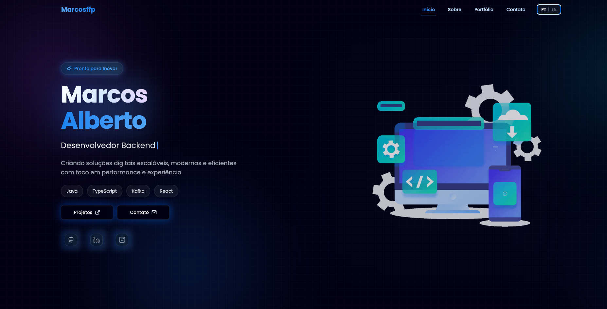

# Marcos Alberto · Portfólio Pessoal

> Site de portfólio full-stack com vitrine de projetos, trajetória profissional, comentários em tempo real, internacionalização e um painel administrativo completo — construído com React, Vite, Tailwind CSS e Supabase.

---

## 🛠️ Stack Principal


---

## 📑 Sumário

- [Sobre o projeto](#-sobre-o-projeto)
- [Preview](#️-preview)
- [Funcionalidades](#-funcionalidades)
- [Internacionalização](#-internacionalização)
- [Painel administrativo](#-painel-administrativo)
- [Arquitetura e estrutura de pastas](#️-arquitetura-e-estrutura-de-pastas)
- [Rotas da aplicação](#-rotas-da-aplicação)
- [Variáveis de ambiente](#-variáveis-de-ambiente)
- [Instalação e execução](#-instalação-e-execução)
- [Build e deploy](#-build-e-deploy)
- [Padrão de código](#-padrão-de-código)
- [Tecnologias e dependências](#-tecnologias-e-dependências)
- [Contato](#-contato)
- [Licença](#-licença)

---

## 📖 Sobre o projeto

Este repositório reúne o **portfólio pessoal de Marcos Alberto (Marcos Fkp)** — uma *single-page application* construída com **React + Vite** que apresenta projetos, trajetória profissional, depoimentos da comunidade e um canal direto de contato. O site é totalmente responsivo, bilíngue (**pt-BR / en**), repleto de animações fluidas (Framer Motion, AOS) e integrado ao **Supabase** para autenticação, persistência de dados, armazenamento de imagens e atualizações em tempo real.

Além da vitrine pública, o projeto conta com um **painel administrativo protegido** (`/dashboard`), onde o proprietário gerencia projetos, linha do tempo de trajetória e modera comentários — sem precisar tocar no código ou redeployar o site.

> A pasta [`v2/`](./v2) contém a versão atual da aplicação (React/Vite), reescrita do portfólio original em HTML/CSS/JS puro que ainda permanece na raiz deste repositório.

---

## 🖼️ Preview



---

## ✨ Funcionalidades

| Área | Destaques |
|---|---|
| **Home** | Hero animado com badge flutuante, título em gradiente e rotação de cargos, CTAs para projetos e contato |
| **Sobre** | Biografia, estatísticas (projetos, anos de experiência) e linha do tempo de trajetória (`TrajectoryTimeline`) |
| **Portfólio** | Showcase de projetos em abas (Projetos · Trajetória · Tecnologias) com `MUI Tabs` + `react-swipeable-views`, alternância "ver mais/menos" e dados vindos do Supabase |
| **Detalhes do projeto** | Rota dedicada `/project/:slug` com SEO dinâmico (`react-helmet-async`), badges de tecnologias e botões de demo/repositório |
| **Contato** | Formulário com envio via FormSubmit, links sociais animados (`SocialLinks`) e seção de comentários da comunidade |
| **Comentários em tempo real** | Postagem com nome, mensagem e foto opcional (upload para o Supabase Storage), comentário fixado em destaque e atualização automática via `supabase.channel(...).on('postgres_changes', …)` |
| **Tela de boas-vindas** | Animação inicial com efeito de digitação e transição suave (`framer-motion` + `AnimatePresence`) antes de revelar a landing page |
| **Widget de presença** | Card "ao vivo" exibindo o que está tocando no Spotify, em qual projeto está codando ou jogando, consumindo uma API de presença local |
| **Background animado** | Blobs com gradiente e efeito de brilho (`AnimatedBackground`) reaproveitados em todas as páginas |

---

## 🌐 Internacionalização

O site é totalmente bilíngue (**pt-BR** / **en**), implementado sem bibliotecas externas de i18n:

- `LanguageContext` expõe `language`, `toggleLanguage` e o hook `useTranslation()`
- Dicionários completos em [`src/translations/index.js`](./v2/src/translations/index.js), organizados por seção (`nav`, `home`, `about`, `portfolio`, `contact`, `dashboard`, …)
- A preferência do usuário é persistida em `localStorage` (`portfolio-lang`) e alternada pelo componente `LanguageToggle`, presente na navbar, no login e no dashboard

---

## 🔐 Painel administrativo

Acessível em `/dashboard`, protegido pelo componente `ProtectedRoute`, que verifica a sessão via `supabase.auth.getUser()` e confirma o papel `admin` na tabela `profiles` antes de liberar o acesso — caso contrário, redireciona para `/login`.

| Módulo | O que permite fazer |
|---|---|
| **Projetos** | CRUD completo dos projetos exibidos no portfólio — título, descrição (pt/en), imagem (upload), tecnologias e links de demo/repositório |
| **Trajetória** | CRUD da linha do tempo (trabalho, estudo, voluntariado), com campos bilíngues, datas de início/fim e ordenação manual |
| **Comentários** | Moderação dos comentários públicos: fixar/desafixar, excluir, buscar por nome/conteúdo e paginação |

A autenticação usa **Supabase Auth** (e-mail/senha) e o controle de acesso é reforçado por *Row Level Security* (RLS) no banco — o frontend nunca decide sozinho quem é administrador.

---

## 🏛️ Arquitetura e estrutura de pastas

```
v2/
├── public/                     # Ícones, GIFs, certificados, sitemap, robots.txt
├── src/
│   ├── components/             # Navbar, Footer, Modal, Cards, SocialLinks, PresenceWidget...
│   ├── contexts/
│   │   └── LanguageContext.jsx # Provider + hooks de internacionalização
│   ├── Pages/
│   │   ├── dashboard/          # Sub-rotas do painel admin (Projects, Trajectory, Comments)
│   │   └── Home · About · Portofolio · Contact · Login · Dashboard · WelcomeScreen · 404
│   ├── translations/
│   │   └── index.js            # Dicionários pt-BR / en
│   ├── utils/
│   │   └── slug.js             # Geração de slugs para URLs de projeto
│   ├── App.jsx                 # Definição de rotas e layouts
│   ├── main.jsx                # Entry point (React + StrictMode)
│   ├── supabase.js             # Cliente Supabase (URL + anon key via env)
│   └── tokens.js               # Tokens de cor compartilhados com o Tailwind
├── index.html                  # Meta tags de SEO, Open Graph e dados estruturados (JSON-LD)
├── tailwind.config.js          # Paleta de cores, animações e keyframes customizados
├── vite.config.js
├── vercel.json                 # Rewrites de SPA (todas as rotas → /)
└── package.json
```

> A aplicação segue o padrão **componentes + páginas + contexto**, com *lazy loading* (`React.lazy` / `Suspense`) nas rotas mais pesadas — Portfólio, Contato, Detalhes do Projeto, Tela de Boas-vindas e 404 — reduzindo o bundle inicial.

---

## 🧭 Rotas da aplicação

| Rota | Página | Acesso |
|---|---|---|
| `/` | Landing page (Home → About → Portfólio → Contato) | Público |
| `/project/:slug` | Detalhes de um projeto específico | Público |
| `/login` | Autenticação do administrador | Público |
| `/dashboard/*` | Painel administrativo (Projetos, Trajetória, Comentários) | Restrito (`role = admin`) |
| `*` | Página 404 | Público |

---

## 🔑 Variáveis de ambiente

Crie um arquivo `.env` na raiz de `v2/`:

```dotenv
# ── Supabase ───────────────────────────────────
VITE_SUPABASE_URL=https://seu-projeto.supabase.co
VITE_SUPABASE_ANON_KEY=sua_chave_anon_publica
```

> Variáveis do Vite precisam do prefixo `VITE_` para ficarem acessíveis via `import.meta.env`. Nunca exponha a `service_role key` no frontend — apenas a `anon key`, protegida por Row Level Security.

---

## 🚀 Instalação e execução

### Pré-requisitos

- Node.js 18+
- npm
- Um projeto no [Supabase](https://supabase.com) com as tabelas `profiles`, `portfolio_comments`, `trajectory`, `projects` e o bucket de storage `profile-images`

### Passo a passo

```bash
# 1. Clone o repositório
git clone https://github.com/marcosffp/portifolio.git
cd portifolio/v2

# 2. Instale as dependências
npm install

# 3. Crie e preencha o arquivo .env (ver seção acima)

# 4. Suba o servidor de desenvolvimento
npm run dev
```

A aplicação ficará disponível em `http://localhost:5173`.

---

## 📦 Build e deploy

```bash
# Build de produção (gera a pasta dist/)
npm run build

# Pré-visualizar o build localmente
npm run preview
```

O deploy é feito na **Vercel**. O arquivo [`vercel.json`](./v2/vercel.json) reescreve todas as rotas para `/`, garantindo que o roteamento client-side do React Router funcione corretamente em recarregamentos e acessos diretos a URLs como `/project/meu-projeto` ou `/dashboard/projects`.

---

## 🎨 Padrão de código

O projeto usa **ESLint** com os plugins `react`, `react-hooks` e `react-refresh` ([`eslint.config.js`](./v2/eslint.config.js)):

```bash
npm run lint
```

**Convenções gerais:**
- Componentes funcionais com Hooks — sem *class components*
- Estilização via **Tailwind CSS**, com tokens de cor compartilhados entre `tokens.js` e `tailwind.config.js`
- Textos visíveis ao usuário sempre via dicionários de tradução (`useTranslation()`), nunca *strings* fixas no JSX
- Componentes pesados carregados sob demanda com `React.lazy` + `Suspense`

---

## 📚 Tecnologias e dependências

| Categoria | Tecnologia | Versão |
|---|---|---|
| Biblioteca UI | React | 18.3 |
| Build tool | Vite | 5.4 |
| Estilização | Tailwind CSS | 3.4 |
| Componentes UI | Material UI (Tabs, AppBar, Box) | 5.18 |
| Roteamento | React Router DOM | 6.30 |
| Backend as a Service | Supabase (Auth · Postgres · Storage · Realtime) | 2.50 |
| Animações | Framer Motion · AOS | 11 / 2.3 |
| Carrossel | react-swipeable-views | 0.14 |
| Ícones | Lucide React · Heroicons · MUI Icons | — |
| Notificações visuais | SweetAlert2 | 11.26 |
| Requisições HTTP | Axios | 1.16 |
| SEO | React Helmet Async | 2.0 |
| Linting | ESLint + plugins React | 9.13 |
| Deploy | Vercel | — |

---

## 📬 Contato

- **LinkedIn:** [linkedin.com/in/marcosfkp](https://www.linkedin.com/in/marcosfkp/)
- **GitHub:** [@marcosffp](https://github.com/marcosffp)
- **Instagram:** [@marcosfkp](https://www.instagram.com/marcosfkp/)

---

## 📄 Licença

Distribuído sob a licença **MIT**. Veja [`LICENSE`](./LICENSE) para mais detalhes.
